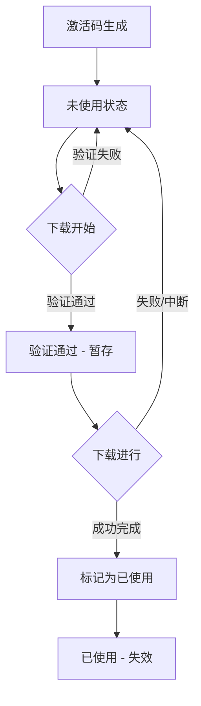

# 激活码使用流程说明

## 🔄 完整使用流程

### 1️⃣ 下载开始前
```
用户输入激活码 → 验证格式 → 验证类型匹配 → 验证有效性
```

**验证规则：**
- ✅ 格式正确：`[S|B]-XXXX-XXXX-XXXX-XXXX`
- ✅ 类型匹配：单次用S-，批量用B-
- ✅ 激活码有效：未被使用过

**如果验证失败：**
- ❌ 阻止下载启动
- 📢 显示错误提示
- 🔑 激活码不会被消耗

### 2️⃣ 下载进行中
```
验证通过 → 保存激活码信息 → 开始下载 → 下载所有文章
```

**特点：**
- 激活码暂时保存，未标记为已使用
- 如果下载失败/中断，激活码不会被消耗
- 用户可以用同一个激活码重试

### 3️⃣ 下载成功完成
```
所有文章下载完成 → 标记激活码为已使用 → 显示提示
```

**自动执行：**
1. ✅ 标记激活码为已使用
2. 📝 日志显示激活码已失效
3. 🔔 弹窗提示用户更换激活码
4. 🧹 清空激活码输入框
5. 🎯 自动聚焦到激活码输入框

**用户看到：**
```
[SUCCESS] 任务完成！
共下载 X 篇文章
[INFO] 激活码 S-XXXX-XXXX-XXXX-XXXX 已使用 (类型: 单次下载)
[WARN] ⚠️  该激活码已失效，如需继续下载请使用新的激活码

弹窗提示：
✅ 下载完成！

⚠️  当前激活码已失效，如需继续下载请更换新的激活码。
```

### 4️⃣ 下载失败/异常
```
下载出错 → 显示错误信息 → 激活码未被消耗
```

**失败处理：**
- ❌ 不标记激活码为已使用
- 📢 显示错误日志
- 💡 提示：激活码未被消耗，可以重新尝试
- 🔄 用户可以用同一个激活码重试

---

## 📊 激活码生命周期



**状态说明：**
- 🟢 **未使用**：可以正常使用
- 🟡 **验证通过-暂存**：正在使用中，但未消耗
- 🔴 **已使用**：已失效，不能再次使用

---

## 🎯 关键设计点

### 1. 验证在开始前
```python
# 在下载开始前验证
if not key_generator.verify_key(activation_key, key_type):
    return {"success": False, "message": "激活码无效"}
```

### 2. 暂存激活码信息
```python
# 验证通过后暂存，不立即标记为已使用
state.current_activation_key = activation_key
state.current_key_type = key_type
```

### 3. 成功后才标记
```python
# 只有在下载成功完成后才标记为已使用
if state.current_activation_key:
    key_generator.mark_as_used(state.current_activation_key)
```

### 4. 失败时不消耗
```python
except Exception as e:
    # 下载失败，不标记激活码为已使用
    await state.broadcast_log(f"[INFO] 由于下载失败，激活码未被消耗，可以重新尝试")
```

---

## 🧪 测试场景

### 场景1：正常下载（单次）
1. 输入 S- 激活码
2. 选择单次下载
3. 下载成功
4. **结果**：激活码失效，提示更换

### 场景2：正常下载（批量）
1. 输入 B- 激活码
2. 选择批量下载10篇
3. 所有文章下载完成
4. **结果**：激活码失效，提示更换

### 场景3：下载失败
1. 输入激活码
2. 开始下载
3. 网络错误/Token过期导致失败
4. **结果**：激活码仍然有效，可以重试

### 场景4：中途暂停再继续
1. 输入激活码
2. 开始下载
3. 点击暂停
4. 点击恢复
5. 下载完成
6. **结果**：激活码失效（因为最终完成了）

### 场景5：类型不匹配
1. 输入 S- 激活码
2. 选择批量下载
3. **结果**：前端阻止，提示类型不匹配，激活码未消耗

### 场景6：重复使用
1. 使用 S- 激活码完成一次下载
2. 不更换激活码，再次点击开始下载
3. **结果**：提示激活码无效或已被使用

---

## 💡 用户体验优化

### 下载完成后的体验
1. **清晰的日志提示**
   ```
   [INFO] 激活码 S-XXXX-XXXX-XXXX-XXXX 已使用
   [WARN] ⚠️  该激活码已失效，如需继续下载请使用新的激活码
   ```

2. **弹窗提醒**
   - 明确告知下载完成
   - 提醒激活码已失效
   - 引导用户更换激活码

3. **自动清空输入框**
   - 清空旧激活码
   - 聚焦到输入框
   - 方便用户输入新激活码

4. **防止误操作**
   - 已使用的激活码无法再次使用
   - 清晰的错误提示

---

## 📋 实现检查清单

- [x] 下载开始前验证激活码有效性
- [x] 验证激活码类型与下载模式匹配
- [x] 验证通过后暂存激活码信息
- [x] 下载成功后标记激活码为已使用
- [x] 下载失败时不消耗激活码
- [x] 显示激活码已使用的日志
- [x] 弹窗提示用户更换激活码
- [x] 自动清空激活码输入框
- [x] 自动聚焦到激活码输入框
- [x] 防止已使用的激活码再次使用

---

## 🔍 常见问题

### Q: 为什么不在验证通过时就标记为已使用？
A: 为了防止下载失败时激活码被浪费。只有成功完成下载，激活码才会被消耗。

### Q: 如果下载到一半失败了怎么办？
A: 激活码不会被消耗，可以用同一个激活码重新尝试。

### Q: 批量下载10篇，只成功了5篇，激活码会失效吗？
A: 如果是下载过程中出错，激活码不会失效。只有全部成功完成才会标记为已使用。

### Q: 能否在下载中途更换激活码？
A: 不能。一旦开始下载，必须等当前任务完成或失败后才能开始新任务。

### Q: 暂停后恢复下载，会重新验证激活码吗？
A: 不会。暂停后恢复使用的是同一个激活码，不需要重新验证。

---

**设计理念：** 公平、高效、用户友好
- ✅ 成功才消耗激活码（公平）
- ✅ 失败可以重试（高效）
- ✅ 清晰的提示和引导（友好）
